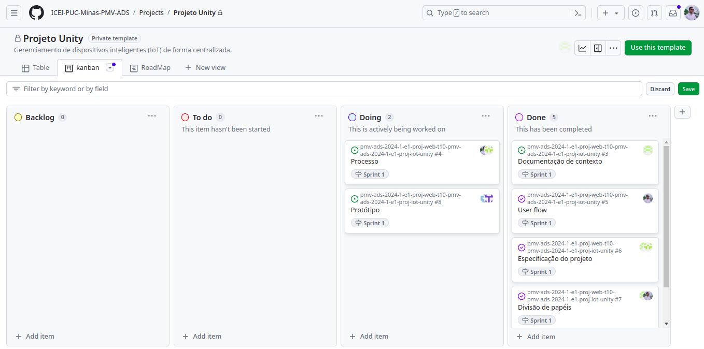

# Metodologia
## Gerenciamento de Projeto
A metodologia ágil escolhida para o desenvolvimento deste projeto foi o SCRUM, pois como citam Amaral, Fleury e Isoni (2019, p. 68), seus benefícios são a

“visão clara dos resultados a entregar; ritmo e disciplina necessários à execução; definição de papéis e responsabilidades dos integrantes do projeto (Scrum Owner, Scrum Master e Team); empoderamento dos membros da equipe de projetos para atingir o desafio; conhecimento distribuído e compartilhado de forma colaborativa; ambiência favorável para crítica às ideias e não às pessoas.”

### Divisão de Papéis

Diante disso, a equipe está oraganizada da seguinte maneira
- **Scrum Master:** Joel Onofre 
- **Product Owner:** Guilherme Henrique
- **Equipe de Desenvolvimento:** Ana Luiza, Bruno Duarte, Guilherme Henrique, Joel Onofre, Larissa Moreira, Rafael Reggiani
- **Equipe de Design:** Ana Luiza e Larissa Moreira

### Processo

- **Backlog:** recebe as tarefas a serem trabalhadas e representa o Product Backlog. Todas as atividades identificadas no decorrer do projeto também devem ser incorporadas a esta lista. 
- **To Do:** Esta lista representa o Sprint Backlog. Este é o Sprint atual que estamos trabalhando. 
- **Doing:** Quando uma tarefa tiver sido iniciada, ela é movida para cá. 
- **Done:** nesta lista são colocadas as tarefas que passaram pelos testes e controle de qualidade e estão prontos para ser entregues ao usuário. Não há mais edições ou revisões necessárias, ele está agendado e pronto para a ação.

Uma vez definido o processo Scrum para a construção do software, a equipe decidiu utilizar a ferramenta GiHub Project para registrar as Sprint e gerenciar as tarefas a serem executadas pelos membros da equipe. A opção por esta ferramenta se baseou na facilidade de uso que ela oferece e pelo fato de estar disponível dentro da própria plataforma do GitHub, que já é relativamente bem conhecida pelos membros da equipe e por sinal abrigará todo o código a ser produzido. A imagem do quadro Kanban cujo link de acesso segue abaixo reflete um determinado momento no tempo do desenvolvimento da segunda etapa do projeto.

  <a href="https://github.com/orgs/ICEI-PUC-Minas-PMV-ADS/projects/1015/views/3">O quadro kanban do grupo no GitHub está disponível neste link e sua imagem pode ser vista abaixo:<a>
  

### Etiquetas

As tarefas são, ainda, etiquetadas em função da natureza da atividade e seguem o seguinte esquema de cores/categorias:
- Atenção extra (Alguns pontos requerem atenção extra)
- Bug (Erro no código)
- Documentação (Documentação do projeto)
- Gestão do projeto (Gerenciamento do projeto)

### Ferramentas
As ferramentas utilizadas no projeto são:

- Editor de código
- Repositório de código
- Ferramentas de gerenciamento e comunicação
- Ferramentas de desenho de tela (_Wireframing_)

As ferramentas foram escolhidas tendo em vista alguns elementos chaves como, versionamento de código, gerenciamento de atividades, unificação de plataformas, isenção de taxas para uso. Com isso, grande parte do projeto é realizada no Github tendo em vista que a ferramenta abrange todos esses requisitos. Referente a ferramenta de Wireframing foi escolhido o Figma devido a sua simplicidade e recepção para o usuário.

Os artefatos do projeto são desenvolvidos a partir das plataformas GitHub e Figma, e a relação dos ambientes com seu respectivo propósito é apresentada na tabela abaixo.

| AMBIENTE                            | PLATAFORMA                         | LINK DE ACESSO                         |
|-------------------------------------|------------------------------------|----------------------------------------|
| Repositório de código fonte | GitHub | https://github.com/ICEI-PUC-Minas-PMV-ADS/pmv-ads-2024-1-e1-proj-web-t10-pmv-ads-2024-1-e1-proj-iot-unity/blob/main/README.md |
| Documentos do projeto | GitHub | https://github.com/ICEI-PUC-Minas-PMV-ADS/pmv-ads-2024-1-e1-proj-web-t10-pmv-ads-2024-1-e1-proj-iot-unity/tree/main |
| Projeto de Interface | Figma | |
| Gerenciamento do Projeto | GitHub | https://github.com/orgs/ICEI-PUC-Minas-PMV-ADS/projects/1015/views/3 |

### Estratégia de Organização de Codificação 

Todos os artefatos relacionados a implementação e visualização dos conteúdos do projeto do site deverão ser inseridos na pasta [codigo-fonte](https://github.com/ICEI-PUC-Minas-PMV-ADS/pmv-ads-2024-1-e1-proj-web-t10-pmv-ads-2024-1-e1-proj-iot-unity/tree/main/codigo-fonte).
